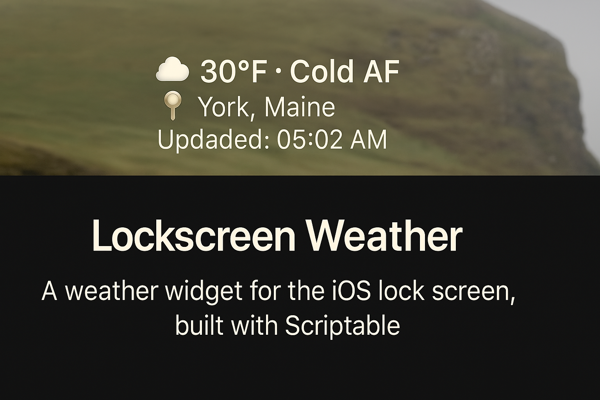
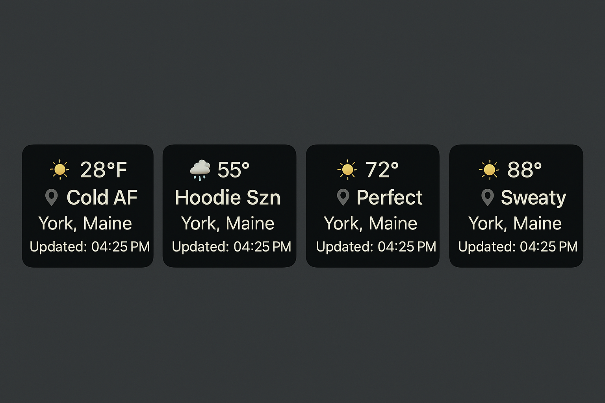

# Lock Screen Weather Widget

**A GPS-powered weather widget for Scriptable, built for iOS Lock Screens.**
Stay updated with hyperlocal, emoji-coded forecasts that match the vibe of your day.

## Features

- **Live Temperature** in °F, straight from Open-Meteo
- **Dynamic Emoji Forecast** based on real-time weather code
- **Location-Aware**: Pulls your exact GPS and converts it to city/state
- **Vibe Reading**: Weather isn't just numbers—it's a mood (e.g., "Cold AF")
- **Last Updated Timestamp** so you know it’s fresh
- **Beautiful Widget Design**: Centered, minimal, clean

## Setup

### 1. Prerequisites

- [Scriptable App](https://apps.apple.com/us/app/scriptable/id1405459188)
- iOS 16+ with Lock Screen widget support

### 2. Add the Scripts

- **Weather Display Script** → shows the widget
- **Location Updater Script** → saves your current GPS to a file used by the display

### 3. Create Shortcuts

- In the **Shortcuts** app, create a new shortcut:
  - Action: “Run Script”
  - Script: `Update Weather Location`
  - Add to Lock Screen as a shortcut button

### 4. Add Widget

- Long press Lock Screen → Customize → Add Widget → Scriptable → Choose `Lockscreen Weather`

## File System

| File Name         | Purpose                    |
|------------------|----------------------------|
| `weather-loc.json` | Stores current lat/lon + timestamp |
| `Lockscreen Weather` | Main display script |
| `Update Weather Location` | Updates GPS location |

## Screenshot

## Built With

- JavaScript (inside Scriptable)
- [Open-Meteo API](https://open-meteo.com/)
- [Nominatim Geocoding API](https://nominatim.org/release-docs/latest/api/Reverse/)

## License

MIT - Make it yours, remix it, go wild.

## Credits

Built with cold hands and a hot idea by [@Rickveloper](https://github.com/Rickveloper)
