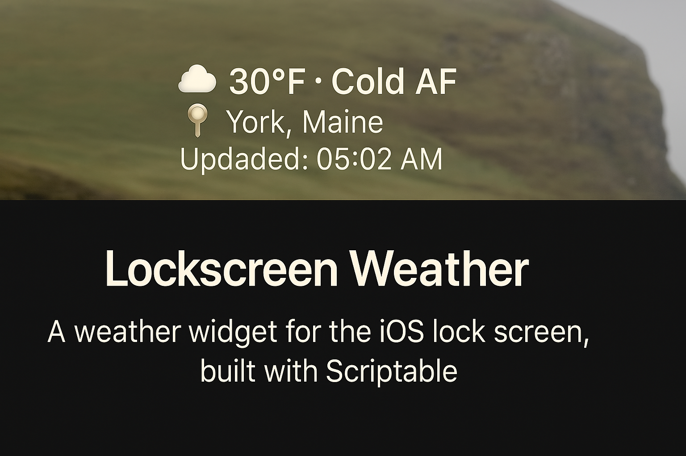
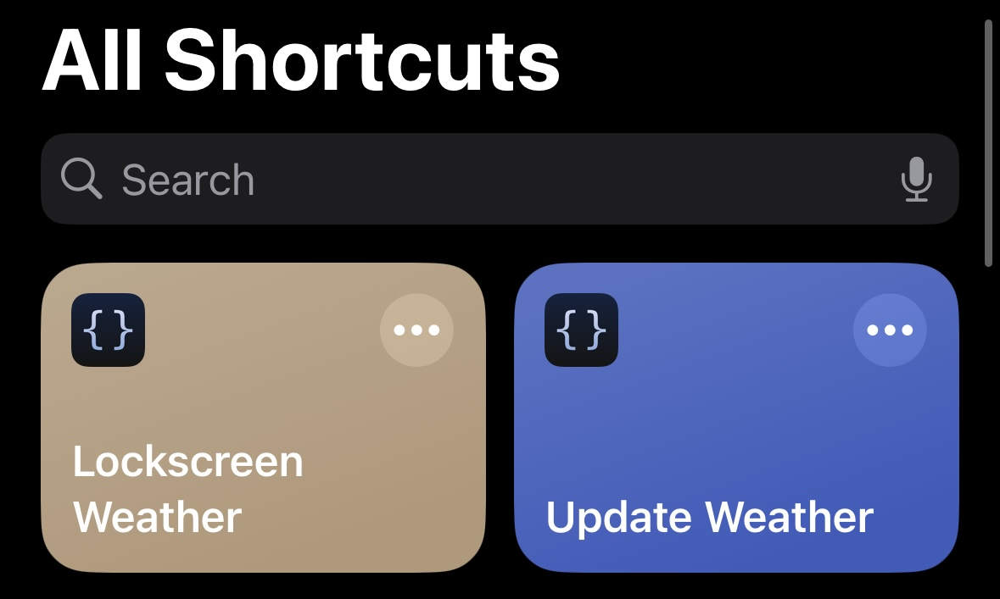
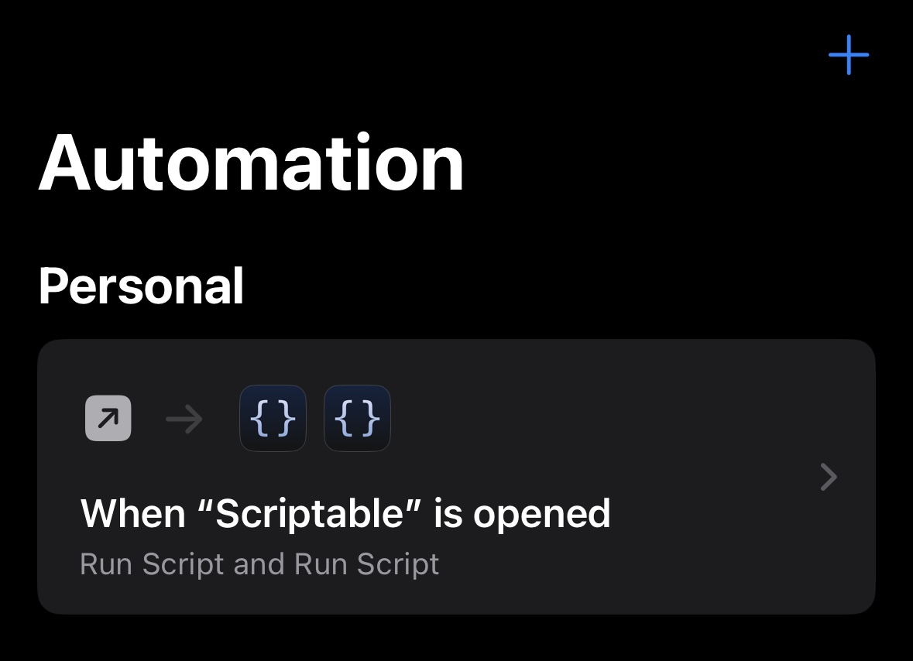
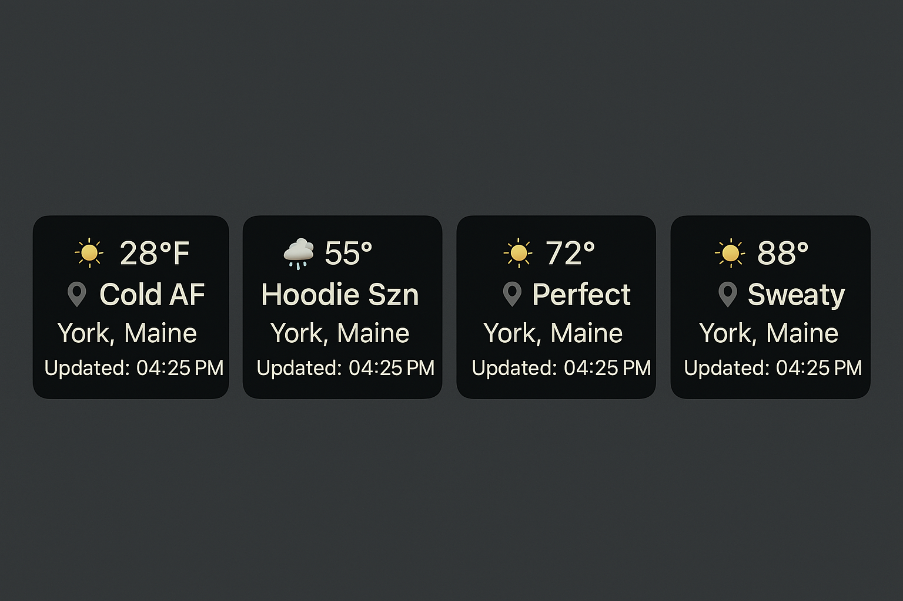

# Lock Screen Weather Widget

<p align="center">
  
</p>

**A GPS-powered weather widget for Scriptable, made for iOS Lock Screens.**  
Stay updated with hyperlocal, emoji-coded forecasts that match the vibe of your day.

---

<p align="center">
  
  
  
</p>

---

## Features

- **Live Temperature** in °F (via Open-Meteo)
- **Emoji Forecast** matching weather vibes
- **Location-Aware**: Automatically grabs city/state
- **Vibe Reading**: Describes the weather in real language (e.g. _Cold AF_)
- **Timestamp**: Shows last updated time
- **Designed for iOS**: Centered, clean, Lock Screen-ready

---

## Setup

### 1. Prerequisites

- [Scriptable App](https://apps.apple.com/us/app/scriptable/id1405459188)
- iOS 16+ with Lock Screen widget support

### 2. Scripts to Add

| Script Name               | Description                          |
|---------------------------|--------------------------------------|
| `Lockscreen Weather`      | Displays the widget                  |
| `Update Weather Location` | Gets your current location silently  |

> Store both scripts inside Scriptable.

### 3. Shortcuts (Optional but Recommended)

Use this if you want a one-tap GPS refresh button on your Lock Screen:

<p align="center">
  
</p>

1. Open the **Shortcuts** app  
2. Create a shortcut:  
   - Action: **Run Script**  
   - Script: `Update Weather Location`  
3. Add it to your Lock Screen as a tap-to-refresh shortcut

### 4. Automation (Optional)

Want it to update automatically when Scriptable launches? Do this:

<p align="center">
  
</p>

1. Open the **Shortcuts** app → Automation tab  
2. Tap "+" → Create Personal Automation  
3. Trigger: **App > Scriptable > Is Opened**  
4. Add **Run Script** twice: once for `Update Weather Location`, once for `Lockscreen Weather`

---

## File System + Scripts

| File                        | Purpose                               |
|-----------------------------|----------------------------------------|
| `weather-loc.json`          | Stores GPS + timestamp for accuracy   |
| `Lockscreen Weather.js`     | Widget display script                  |
| `Update Weather Location.js`| Location grabber (runs silently)      |

---

Widget Demo
<p align="center">
  
</p>


---

APIs Used
	•	Open-Meteo Weather API
	•	Nominatim Reverse Geocoding

---

License

MIT — Free to remix, build on, or launch from.

---

Credits

Built with cold hands and a hot idea by @Rickveloper

---

Coming Soon
	•	Light/dark theme toggle
	•	Temperature in °C
	•	Weather alerts
	•	Home screen widget version
	•	Animated icons

<details>
<summary><strong>▶ Update Weather Location.js</strong></summary>

```js
// Weather Location Updater — Enhanced Version
// This script updates your location data for the weather widget silently

let fm = FileManager.local();
let path = fm.joinPath(fm.documentsDirectory(), "weather-loc.json");

let notification = new Notification();
notification.title = "Updating Location";
notification.subtitle = "Getting current coordinates...";
notification.schedule();

try {
  Location.setAccuracyToBest();
  let loc = await Location.current();
  let timestamp = new Date().toISOString();

  let existingData = {};
  if (fm.fileExists(path)) {
    try {
      existingData = JSON.parse(fm.readString(path));
    } catch (e) {
      console.log("Error reading existing data: " + e);
    }
  }

  let data = {
    ...existingData,
    latitude: loc.latitude,
    longitude: loc.longitude,
    timestamp: timestamp,
    lastUpdated: new Date().toLocaleString()
  };

  fm.writeString(path, JSON.stringify(data, null, 2));

  notification = new Notification();
  notification.title = "Location Updated";
  notification.subtitle = "Weather data will refresh on next widget load";
  notification.schedule();

} catch (e) {
  notification = new Notification();
  notification.title = "Location Update Failed";
  notification.subtitle = "Please try again later";
  notification.body = e.toString();
  notification.schedule();

  console.error("Error updating location: " + e);
}

Script.complete();
</details>
<details>
<summary><strong>▶ Lockscreen Weather.js</strong></summary>
```js
// Lockscreen Weather Widget — Centered Version
let fm = FileManager.local();
let path = fm.joinPath(fm.documentsDirectory(), "weather-loc.json");

let locData = { latitude: 43.15, longitude: -70.65 };
if (fm.fileExists(path)) {
  try {
    locData = JSON.parse(fm.readString(path));
  } catch {}
}

let lat = locData.latitude;
let lon = locData.longitude;

let weather = await new Request(`https://api.open-meteo.com/v1/forecast?latitude=${lat}&longitude=${lon}&current=temperature_2m,weathercode&temperature_unit=fahrenheit`).loadJSON();
let geo = await new Request(`https://nominatim.openstreetmap.org/reverse?lat=${lat}&lon=${lon}&format=json`).loadJSON();

let tempF = Math.round(weather.current.temperature_2m);
let code = weather.current.weathercode;
let city = geo.address.city || geo.address.town || geo.address.village || geo.address.hamlet || "";

let emoji = "☁️";
if (code == 0) emoji = "☀️";
else if (code <= 2) emoji = "🌤";
else if (code <= 3) emoji = "☁️";
else if (code <= 48) emoji = "🌫";
else if (code <= 67) emoji = "🌧";
else if (code <= 77) emoji = "❄️";
else if (code <= 99) emoji = "⛈";

let vibe = tempF < 40 ? "Cold AF" :
           tempF < 60 ? "Hoodie Szn" :
           tempF < 75 ? "Perfect" :
           tempF < 90 ? "Sweaty" : "Scorchin";

let widget = new ListWidget();
widget.setPadding(5, 8, 5, 8);
widget.backgroundColor = new Color("#111111", 1);

let tempLine = widget.addText(`${emoji} ${tempF}°`);
tempLine.font = Font.boldSystemFont(16);
tempLine.textColor = Color.white();
tempLine.lineLimit = 1;
tempLine.centerAlignText();

let vibeLine = widget.addText(`${vibe}`);
vibeLine.font = Font.mediumSystemFont(14);
vibeLine.textColor = Color.white();
vibeLine.lineLimit = 1;
vibeLine.centerAlignText();

widget.addSpacer(4);

let locLine = widget.addText(`📍 ${city}`);
locLine.font = Font.mediumSystemFont(12);
locLine.textColor = Color.white();
locLine.lineLimit = 1;
locLine.centerAlignText();

widget.addSpacer(2);

let updated = new Date().toLocaleTimeString([], {
  hour: "2-digit",
  minute: "2-digit"
});
let timeLine = widget.addText(`Updated: ${updated}`);
timeLine.font = Font.systemFont(10);
timeLine.textColor = Color.white();
timeLine.lineLimit = 1;
timeLine.centerAlignText();

Script.setWidget(widget);
Script.complete();
</details>
```
<details>
<summary><strong>▶ Lockscreen Weather.js</strong></summary>

```js
// Lockscreen Weather Widget — Centered Version
let fm = FileManager.local();
let path = fm.joinPath(fm.documentsDirectory(), "weather-loc.json");

// Fallback if weather-loc.json is missing or broken
let locData = { latitude: 43.15, longitude: -70.65 };
if (fm.fileExists(path)) {
  try {
    locData = JSON.parse(fm.readString(path));
  } catch {}
}

let lat = locData.latitude;
let lon = locData.longitude;

// Fetch weather data
let weather = await new Request(`https://api.open-meteo.com/v1/forecast?latitude=${lat}&longitude=${lon}&current=temperature_2m,weathercode&temperature_unit=fahrenheit`).loadJSON();
let geo = await new Request(`https://nominatim.openstreetmap.org/reverse?lat=${lat}&lon=${lon}&format=json`).loadJSON();

let tempF = Math.round(weather.current.temperature_2m);
let code = weather.current.weathercode;
let city = geo.address.city || geo.address.town || geo.address.village || geo.address.hamlet || "";

// Hard-coded emoji based on weather code
let emoji = "☁️"; // Default cloud emoji
if (code == 0) emoji = "☀️";
else if (code <= 2) emoji = "🌤";
else if (code <= 3) emoji = "☁️";
else if (code <= 48) emoji = "🌫";
else if (code <= 67) emoji = "🌧";
else if (code <= 77) emoji = "❄️";
else if (code <= 99) emoji = "⛈";

// Full vibe text
let vibe = tempF < 40 ? "Cold AF" :
           tempF < 60 ? "Hoodie Szn" :
           tempF < 75 ? "Perfect" :
           tempF < 90 ? "Sweaty" : "Scorchin";

// Create widget with multi-line layout
let widget = new ListWidget();
widget.setPadding(5, 8, 5, 8);
widget.backgroundColor = new Color("#111111", 1);

// First line: emoji and temperature only - centered
let tempLine = widget.addText(`${emoji} ${tempF}°`);
tempLine.font = Font.boldSystemFont(16);
tempLine.textColor = Color.white();
tempLine.lineLimit = 1;
tempLine.centerAlignText();

// Second line: vibe text - centered
let vibeLine = widget.addText(`${vibe}`);
vibeLine.font = Font.mediumSystemFont(14);
vibeLine.textColor = Color.white();
vibeLine.lineLimit = 1;
vibeLine.centerAlignText();

widget.addSpacer(4);

// Location line with just city - centered
let locLine = widget.addText(`📍 ${city}`);
locLine.font = Font.mediumSystemFont(12);
locLine.textColor = Color.white();
locLine.lineLimit = 1;
locLine.centerAlignText();

widget.addSpacer(2);

// Update time - centered
let updated = new Date().toLocaleTimeString([], {
  hour: "2-digit",
  minute: "2-digit"
});
let timeLine = widget.addText(`Updated: ${updated}`);
timeLine.font = Font.systemFont(10);
timeLine.textColor = Color.white();
timeLine.lineLimit = 1;
timeLine.centerAlignText();

Script.setWidget(widget);
Script.complete();
</details>
```
